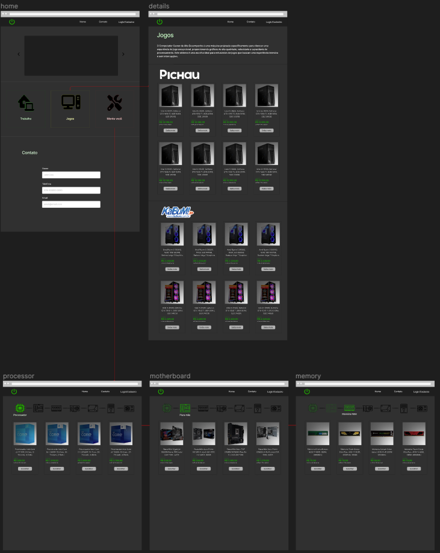
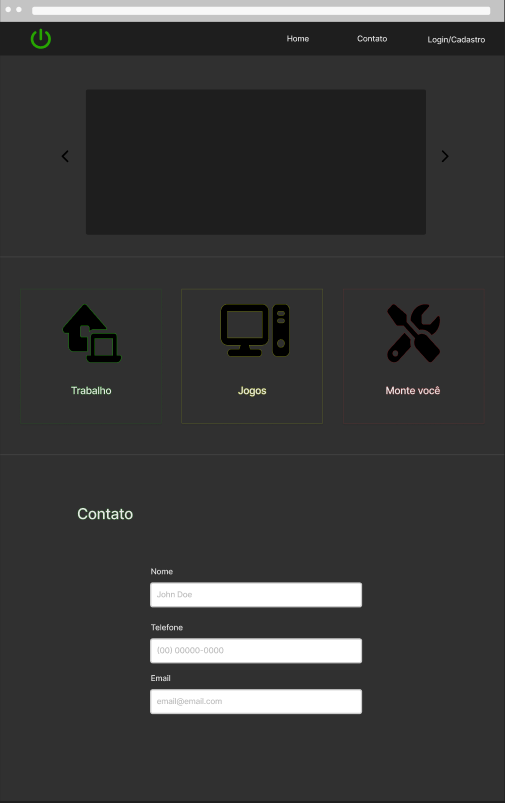
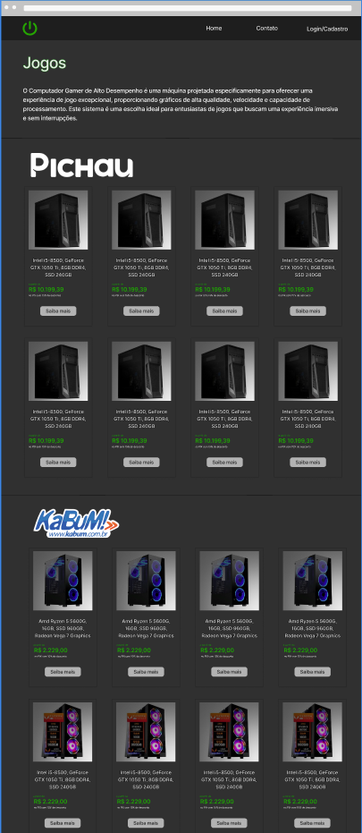
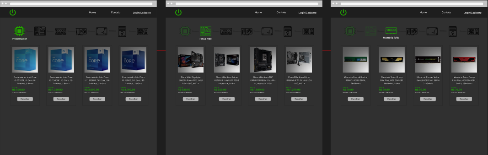

# Informações do Projeto
`TITULO` 

Monte seu PC

`CURSO` 

Análise e Desenvolvimento de sistemas

## Participantes

* Bruno Filipe Ramos Martins
* Breno de Oliveira Hassel
* Washington Junio Lima
* João Pedro Ferreira Bonifácio
* Bernardo Dias Castro
* Nathan Garibalde Rocha

# Estrutura do Documento

- [Informações do Projeto](#informações-do-projeto)
  - [Participantes](#participantes)
- [Estrutura do Documento](#estrutura-do-documento)
- [Introdução](#introdução)
  - [Problema](#problema)
  - [Objetivos](#objetivos)
  - [Justificativa](#justificativa)
  - [Público-Alvo](#público-alvo)
- [Especificações do Projeto](#especificações-do-projeto)
  - [Personas e Mapas de Empatia](#personas-e-mapas-de-empatia)
  - [Histórias de Usuários](#histórias-de-usuários)
  - [Requisitos](#requisitos)
    - [Requisitos Funcionais](#requisitos-funcionais)
    - [Requisitos não Funcionais](#requisitos-não-funcionais)
  - [Restrições](#restrições)
- [Projeto de Interface](#projeto-de-interface)
  - [User Flow](#user-flow)
  - [Wireframes](#wireframes)
- [Metodologia](#metodologia)
  - [Divisão de Papéis](#divisão-de-papéis)
  - [Ferramentas](#ferramentas)
  - [Controle de Versão](#controle-de-versão)
- [**############## SPRINT 1 ACABA AQUI #############**](#-sprint-1-acaba-aqui-)
- [Projeto da Solução](#projeto-da-solução)
  - [Tecnologias Utilizadas](#tecnologias-utilizadas)
  - [Arquitetura da solução](#arquitetura-da-solução)
- [Avaliação da Aplicação](#avaliação-da-aplicação)
  - [Plano de Testes](#plano-de-testes)
  - [Ferramentas de Testes (Opcional)](#ferramentas-de-testes-opcional)
  - [Registros de Testes](#registros-de-testes)
- [Referências](#referências)

# Introdução

## Problema
- **Falta de Conhecimento**: Muitas pessoas podem não ter conhecimento suficiente sobre como montar um PC por conta própria. Nosso site pode ajudar a preencher essa lacuna, oferecendo informações detalhadas e guias passo a passo.
- **Dificuldade em Escolher Componentes**: Selecionar os componentes certos para um PC pode ser confuso para iniciantes. Nosso site pode orientar os usuários na escolha de peças compatíveis e que atendam às suas necessidades.
- **Orçamento Limitado**: Alguns usuários podem ter um orçamento apertado para montar um PC. Nosso site pode oferecer sugestões para montagens de baixo custo ou alternativas econômicas de componentes.
- **Necessidade de Especificações Personalizadas**: Muitos usuários desejam PCs personalizados para atender a necessidades específicas, como jogos, edição de vídeo ou design gráfico. Nosso site pode ajudar a projetar sistemas personalizados.
- **Compatibilidade e Drivers**: Muitos usuários podem enfrentar problemas relacionados à compatibilidade de hardware e à instalação de drivers. Nosso site pode oferecer orientações nesses aspectos. 

## Objetivos

O objetivo geral deste projeto é desenvolver um site eficaz para solucionar o problema identificado anteriormente, ou seja, auxiliar os usuários na montagem de seus próprios PCs de forma simples e acessível.

Para atingir esse objetivo geral, definimos os seguintes objetivos específicos:

- **Desenvolver uma Interface Amigável**: Nosso primeiro objetivo específico é criar uma interface de usuário intuitiva e fácil de usar. Isso permitirá que mesmo iniciantes na montagem de PCs possam navegar e utilizar o programa sem dificuldades.

- **Fornecer Guia Passo a Passo**: O segundo objetivo específico é fornecer um guia passo a passo detalhado para a montagem de um PC. Isso incluirá informações sobre a seleção de componentes, montagem física, instalação de software e solução de problemas comuns.

## Justificativa

A decisão de criar o site "Monte Seu PC" baseia-se em várias razões fundamentais que destacam a importância e a motivação para a realização deste projeto. Essas razões são essenciais para entender por que escolhemos nossos objetivos específicos e por que nos aprofundamos em certos aspectos do software. 

- **Necessidade de Acesso a Informações Confiáveis**: Atualmente, a montagem de PCs é uma habilidade valiosa, mas muitos indivíduos enfrentam dificuldades devido à falta de informações confiáveis e acessíveis. A justificativa principal para este projeto é preencher essa lacuna, fornecendo aos usuários informações precisas e detalhadas sobre como montar um PC.

- **Potencial para Impacto Positivo**: Ao capacitar os usuários a montar seus próprios PCs, acreditamos que podemos fazer uma contribuição positiva para a comunidade de tecnologia e, ao mesmo tempo, ajudar os indivíduos a obterem o máximo de seus investimentos em hardware.

- **Foco na Experiência do Usuário**: A experiência do usuário é fundamental em nosso projeto. Queremos garantir que os usuários, independentemente de seu nível de habilidade, tenham uma experiência de aprendizado agradável e eficaz ao usar nosso software.

## Público-Alvo

Nosso site "Monte Seu PC" tem como objetivo atender a uma ampla gama de públicos, pois a montagem de PCs é uma atividade que pode atrair diversos perfis de usuários. Aqui estão os principais grupos dentro do nosso público-alvo:

- **Iniciantes em Montagem de PCs**: Este grupo é composto por pessoas que têm pouco ou nenhum conhecimento prévio sobre a montagem de computadores. Eles podem ser entusiastas de tecnologia que desejam aprender a montar seu primeiro PC.

- **Hobbistas e Entusiastas**: Esses usuários têm algum conhecimento básico em montagem de PCs e desejam aprofundar seus conhecimentos. Eles podem estar interessados em criar sistemas de alto desempenho para jogos, edição de vídeo ou outras atividades específicas.

- **Usuários de Todos os Gêneros e Idades**: O site é projetado para ser inclusivo, atraindo usuários de todas as idades, gêneros e origens culturais. Queremos que seja acessível para todos.

- **Pessoas com Orçamento Limitado**: Indivíduos que têm orçamento limitado para montar um PC e buscam orientação sobre como fazer escolhas econômicas de componentes.

**Nosso objetivo é criar um ambiente inclusivo, informativo e educacional que atenda a todos os membros do nosso público-alvo, independentemente de seu nível de conhecimento em montagem de PCs.**

 
# Especificações do Projeto

Para desenvolver o site "Monte Seu PC", utilizaremos uma abordagem abrangente que abordará as necessidades de diferentes perfis de usuários dentro do nosso público-alvo. As principais técnicas e ferramentas que serão usadas nesta fase incluem:

- **Levantamento de Requisitos**: Inicialmente, realizaremos um levantamento detalhado de requisitos, que incluirá entrevistas com membros da equipe, pesquisa de mercado e análise das necessidades dos usuários. Isso nos ajudará a definir as funcionalidades-chave do site.

- **Wireframes e Prototipagem**: Criaremos wireframes e protótipos interativos para visualizar a estrutura do site e a disposição dos elementos da interface do usuário. Isso nos permitirá validar o design e a usabilidade antes da implementação.

- **Iterações e Melhorias Contínuas**: Planejamos realizar iterações regulares no projeto com base no feedback dos usuários, incorporando melhorias contínuas e novas funcionalidades.

- **Desenvolvimento de Interface do Usuário**: Criaremos uma interface de usuário amigável usando tecnologias web, garantindo que o site seja responsivo para dispositivos móveis e ofereça uma experiência agradável ao usuário.

## Personas e Mapas de Empatia

**Nome: Maria Silva**

Idade: 28 anos

Profissão: Designer Gráfico

Nível de Experiência em Montagem de PCs: Iniciante

Interesses e Necessidades:

Maria é uma designer gráfico que usa o computador para trabalhar em projetos criativos, como edição de imagens e design gráfico.
Ela está interessada em montar um PC personalizado para atender às suas necessidades de desempenho e design.
Maria não tem muita experiência em montagem de PCs, portanto, procura informações e orientações claras para ajudá-la a escolher os componentes certos.
Ela está preocupada com o orçamento e deseja encontrar opções acessíveis, mas também quer um PC que seja rápido e confiável para seu trabalho.
Maria valoriza a estética e o design do PC, pois deseja que ele se encaixe bem em seu espaço de trabalho.
Objetivos ao Visitar seu Site:

Aprender sobre os componentes necessários para montar um PC para suas necessidades específicas.
Encontrar orientações passo a passo sobre como montar um PC, incluindo dicas de montagem e compatibilidade.
Comparar preços e opções para encontrar componentes que se encaixem em seu orçamento.
Obter informações sobre as melhores práticas de design de PCs para que seu computador seja funcional e estéticamente agradável.
Desafios:

Falta de experiência em montagem de PCs.
Preocupação com o custo total do projeto.
Necessidade de orientações claras e fáceis de seguir.

**Nome: Ana**

Idade: 28 anos

Hobby: Jogar videogames

Trabalho: Designer gráfica

Personalidade: Extrovertida, entusiástica, amigável
Sonhos: Tornar-se uma streamer de jogos popular

Objetos e Lugares:
Ana usa um computador gaming personalizado com componentes de alta performance. Ela também usa redes sociais e aplicativos de streaming para se conectar com sua comunidade de jogos. Ela joga em casa, em seu escritório e faz streaming em plataformas online.

Objetivos Chave:
Seus objetivos-chave incluem encontrar um PC de jogos que atenda às suas necessidades de desempenho e transmitir jogos com qualidade. Ela precisa desse serviço para obter orientação sobre as melhores peças e configurações para seus jogos e streaming.

Como Devemos Tratá-La:
Trate Ana com entusiasmo e interesse genuíno por seus projetos de jogos. Respeite sua paixão e forneça recomendações personalizadas para suas necessidades de montagem de PC.

## Histórias de Usuários

Com base na análise das personas forma identificadas as seguintes histórias de usuários:

|EU COMO... `PERSONA`| QUERO/PRECISO ... `FUNCIONALIDADE` |PARA ... `MOTIVO/VALOR`                 |
|--------------------|------------------------------------|----------------------------------------|
|Usuário do sistema  | Um auxílio para montar um computador ideal para o que eu necessito      | Para que eu possa ter uma experiência de trabalho/estudo melhor             |
|Administrador       | Auxiliar os usuários                 | Fornecer suporte aos usuários, respondendo a perguntas, solucionando problemas e oferecendo orientação técnica.|

## Requisitos

As tabelas que se seguem apresentam os requisitos funcionais e não funcionais que detalham o escopo do projeto.

### Requisitos Funcionais

|ID    | Descrição do Requisito  | Prioridade |
|------|-----------------------------------------|----|
|RF-001| Permitir que os usuários se registrem em suas contas no site para acessar recursos personalizados, como salvar configurações de PC e tutoriais preferidos. | ALTA |
|RF-001| Fornecer uma interface de busca para que os usuários possam pesquisar e selecionar componentes de hardware, como processadores, placas de vídeo e memória RAM, para suas configurações de PC | ALTA |  
|RF-001| Implementar uma seção de tutoriais interativos que orientam os usuários passo a passo na montagem de PCs, incluindo seleção de componentes. | ALTA |  
|RF-004| Disponibilizar uma seção de comparação de preços, onde os usuários possam comparar os preços de componentes de hardware em diferentes lojas online. | MÉDIA | 

### Requisitos não Funcionais

|ID     | Descrição do Requisito  |Prioridade |
|-------|-------------------------|----|
|RNF-001| O site deve ser responsivo e otimizado para dispositivos móveis, garantindo uma experiência de usuário consistente em desktops, smartphones e tablets. | ALTA | 
|RNF-002|  O tempo máximo de resposta do site para processar requisições de usuário, como carregar páginas e recursos, deve ser de no máximo 3 segundos para manter a usabilidade. |  MÉDIA | 
|RNF-003| O site deve ser escalável para acomodar um aumento significativo no tráfego de usuários |  BAIXA | 
|RNF-004| O site deve ser projetado para facilitar a atualização de conteúdo, permitindo que a equipe de administração do site adicione, edite e exclua facilmente tutoriais, componentes de hardware e outros recursos. |  ALTA | 

## Restrições

O projeto está restrito pelos itens apresentados na tabela a seguir.

|ID| Restrição                                             |
|--|-------------------------------------------------------|
|01| O projeto deverá ser entregue até o final do semestre |
|02| Não pode ser desenvolvido um módulo de backend        |

# Projeto de Interface

As soluções de interface para "Monte seu PC" consiste em interfaces que os usuários interagem para alcançar seus objetivos. Listarei algumas das principais interfaces da solução elaboradas para atender aos requisitos funcionais e não funcionais:
Tutoriais interativos, resgistro de conta e acesso a recursos personalizados, programa de responsividade, interface de busca de peças e entre outros.

## User Flow

> 

## Wireframes

> **Tela Inicial**:
> 
> 
> 
> **Tela de detalhes**:
> 
> 
> 
> **Tela de monte você**:
> 
> 

# Metodologia

Para garantir a eficiência e o sucesso do projeto, cada membro do grupo assumiu papéis e responsabilidades específicas de acordo com suas habilidades e interesses. Realizamos reuniões semanais pelo Discord para discutir o progresso do projeto.
Ferramentas empregadas:

DISCORD: Realizamos reuniões semanais no Discord para discutir o progresso do projeto, atribuir tarefas e resolver questões emergentes. Além disso, usamos canais de comunicação para manter uma comunicação contínua entre os membros.

## Divisão de Papéis

Bernardo Castro - Slide / Apresentação:
- **Responsável por criar os slides e apresentar o projeto**.

Bruno Martins - Wireframe / Apresentação:
- **Encarregado de criar os wireframes, que representam a estrutura e o layout do site**.

Washington Junio / Breno Hassel - Documentação:
- **Responsáveis pela documentação detalhada do projeto**.

Nathan Rocha / João Pedro - Design Thinking:
- **Encarregados de aplicar a abordagem de Design Thinking ao projeto**.

## Ferramentas

Foram usado as seguintes ferramentas no projeto: 

| Ambiente  | Plataforma              |Link de Acesso |
|-----------|-------------------------|---------------|
|Repositório de código | GitHub | https://github.com/ICEI-PUCMinas-PSG-SI-TI/tiaw-2023-2-monteseupc/tree/master/codigo | 
|Canal de Comunicação | Discord |  https://discord.com | 
|Protótipo Interativo |  Figma | https://www.figma.com/file/iP3EuLyG3iLJk5mxpsQFze/Monte-seu-PC?type=design&node-id=0-1&mode=design | 

## Controle de Versão

......  COLOQUE AQUI O SEU TEXTO ......

> Discuta como a configuração do projeto foi feita na ferramenta de
> versionamento escolhida. Exponha como a gerência de tags, merges,
> commits e branchs é realizada. Discuta como a gerência de issues foi
> realizada.
> A ferramenta de controle de versão adotada no projeto foi o
> [Git](https://git-scm.com/), sendo que o [Github](https://github.com)
> foi utilizado para hospedagem do repositório `upstream`.
> 
> O projeto segue a seguinte convenção para o nome de branchs:
> 
> - `master`: versão estável já testada do software
> - `unstable`: versão já testada do software, porém instável
> - `testing`: versão em testes do software
> - `dev`: versão de desenvolvimento do software
> 
> Quanto à gerência de issues, o projeto adota a seguinte convenção para
> etiquetas:
> 
> - `bugfix`: uma funcionalidade encontra-se com problemas
> - `enhancement`: uma funcionalidade precisa ser melhorada
> - `feature`: uma nova funcionalidade precisa ser introduzida
>
> **Links Úteis**:
> - [Tutorial GitHub](https://guides.github.com/activities/hello-world/)
> - [Git e Github](https://www.youtube.com/playlist?list=PLHz_AreHm4dm7ZULPAmadvNhH6vk9oNZA)
> - [5 Git Workflows & Branching Strategy to deliver better code](https://zepel.io/blog/5-git-workflows-to-improve-development/)
>
> **Exemplo - GitHub Feature Branch Workflow**:
>
> 

# **############## SPRINT 1 ACABA AQUI #############**

# Projeto da Solução

......  COLOQUE AQUI O SEU TEXTO ......

## Tecnologias Utilizadas

......  COLOQUE AQUI O SEU TEXTO ......

> Descreva aqui qual(is) tecnologias você vai usar para resolver o seu
> problema, ou seja, implementar a sua solução. Liste todas as
> tecnologias envolvidas, linguagens a serem utilizadas, serviços web,
> frameworks, bibliotecas, IDEs de desenvolvimento, e ferramentas.
> Apresente também uma figura explicando como as tecnologias estão
> relacionadas ou como uma interação do usuário com o sistema vai ser
> conduzida, por onde ela passa até retornar uma resposta ao usuário.
> 
> Inclua os diagramas de User Flow, esboços criados pelo grupo
> (stoyboards), além dos protótipos de telas (wireframes). Descreva cada
> item textualmente comentando e complementando o que está apresentado
> nas imagens.

## Arquitetura da solução

......  COLOQUE AQUI O SEU TEXTO E O DIAGRAMA DE ARQUITETURA .......

> Inclua um diagrama da solução e descreva os módulos e as tecnologias
> que fazem parte da solução. Discorra sobre o diagrama.
> 
> **Exemplo do diagrama de Arquitetura**:
> 
> 

# Avaliação da Aplicação

......  COLOQUE AQUI O SEU TEXTO ......

> Apresente os cenários de testes utilizados na realização dos testes da
> sua aplicação. Escolha cenários de testes que demonstrem os requisitos
> sendo satisfeitos.

## Plano de Testes

......  COLOQUE AQUI O SEU TEXTO ......

> Enumere quais cenários de testes foram selecionados para teste. Neste
> tópico o grupo deve detalhar quais funcionalidades avaliadas, o grupo
> de usuários que foi escolhido para participar do teste e as
> ferramentas utilizadas.
> 
> **Links Úteis**:
> - [IBM - Criação e Geração de Planos de Teste](https://www.ibm.com/developerworks/br/local/rational/criacao_geracao_planos_testes_software/index.html)
> - [Práticas e Técnicas de Testes Ágeis](http://assiste.serpro.gov.br/serproagil/Apresenta/slides.pdf)
> -  [Teste de Software: Conceitos e tipos de testes](https://blog.onedaytesting.com.br/teste-de-software/)

## Ferramentas de Testes (Opcional)

......  COLOQUE AQUI O SEU TEXTO ......

> Comente sobre as ferramentas de testes utilizadas.
> 
> **Links Úteis**:
> - [Ferramentas de Test para Java Script](https://geekflare.com/javascript-unit-testing/)
> - [UX Tools](https://uxdesign.cc/ux-user-research-and-user-testing-tools-2d339d379dc7)

## Registros de Testes

......  COLOQUE AQUI O SEU TEXTO ......

> Discorra sobre os resultados do teste. Ressaltando pontos fortes e
> fracos identificados na solução. Comente como o grupo pretende atacar
> esses pontos nas próximas iterações. Apresente as falhas detectadas e
> as melhorias geradas a partir dos resultados obtidos nos testes.

# Referências

......  COLOQUE AQUI O SEU TEXTO ......

> Inclua todas as referências (livros, artigos, sites, etc) utilizados
> no desenvolvimento do trabalho.
> 
> **Links Úteis**:
> - [Formato ABNT](https://www.normastecnicas.com/abnt/trabalhos-academicos/referencias/)
> - [Referências Bibliográficas da ABNT](https://comunidade.rockcontent.com/referencia-bibliografica-abnt/)
